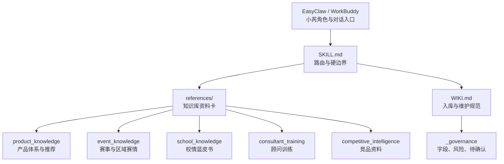

# ideaLab 知识库与 Agent Skill

这是给 ideaLab/斯坦星球科创业务使用的知识库包。它不是单纯的提示词，也不是把素材全部塞进 `SKILL.md` 的文档包。

当前定位：

- 宿主平台：EasyClaw，目前也可能迁移到 WorkBuddy 等 AI 平台。
- 角色人设：由宿主平台提供“小芮”角色、语气和身份。
- 本包职责：提供产品、赛事、校情、赛情、顾问训练和维护规范。
- 维护人：用户和 Serry/信芮。
- 稳定分支：`main`。

## 总体架构

## 文件分工

| 文件/目录 | 作用 |
|---|---|
| `SKILL.md` | Agent 入口路由。只写“遇到什么问题读哪里、哪些边界不能越过”。 |
| `WIKI.md` | 维护规范。告诉 agent 新材料怎么清洗、怎么入库、怎么判断风险。 |
| `skill.json` | 机器索引、关键词、版本和发布信息。 |
| `references/product_knowledge/` | 产品体系、产品卡、推荐逻辑、销售与合同边界。 |
| `references/event_knowledge/` | 赛事知识、三赛联动、区域赛事赛情、官方数据和图片附件索引。 |
| `references/school_knowledge/` | 校情蓝皮书、城市卡、学校资料卡、学校索引、班型资料卡。 |
| `references/consultant_training/` | 模拟家长、顾问考核、FAQ、评分规则、钉钉内部文档入口。 |
| `references/competitive_intelligence/` | 竞品对比卡。 |
| `references/planning_cases/` | 历史规划案例。 |
| `references/_governance/` | 字段规范、更新规则、待确认队列、来源置信度。 |

## 核心原则

`SKILL.md` 是路由，不是资料库。用户或同事说“更新到 skill”时，默认理解为“更新 ideaLab 知识包”，不等于直接改 `SKILL.md`。

分流规则：

- 产品、价格、课程、赛事、校情、赛情、话术：写到 `references/`。
- 新材料清洗流程、字段设计、维护规则：写到 `WIKI.md` 或 `_governance/`。
- 新问题类型需要改变读取路径：才改 `SKILL.md`。
- 新关键词、版本、发布信息：才改 `skill.json`。

## 使用方式

在宿主平台里，小芮收到顾问问题后：

1. 先由宿主平台提供角色、人设和语气。
2. `SKILL.md` 判断问题类型。
3. 读取对应资料卡。
4. 按家长端或内部端的表达边界回答。
5. 普通答疑不自动改文件。

常见问题和读取路径：

| 问题 | 读取来源 |
|---|---|
| ideaLab 产品体系怎么讲 | `references/product_knowledge/产品总览.md` |
| 孩子适合什么课程 | `references/product_knowledge/推荐逻辑.md` |
| 启航、领航、竞赛营、专项营怎么选 | `references/product_knowledge/产品卡片/` |
| 价格、合同、退费怎么说 | `references/product_knowledge/销售与合同边界.md` |
| 三赛联动怎么介绍 | `references/event_knowledge/三赛联动_Lab赛事包/` |
| 浦东雏鹰杯什么时候申报 | `references/event_knowledge/区域赛事赛情/浦东新区.md` |
| 某学校重视科创吗 | `references/school_knowledge/学校资料卡/` |
| 上海某区有哪些科创特色初中 | `references/school_knowledge/学校索引/` |
| 模拟家长或顾问考核 | `references/consultant_training/` |
| 钉钉占座表和内部 SOP | `references/consultant_training/dingtalk_internal_docs.md` |

## 小芮 fallback

宿主平台通常会提供小芮的人设。本包只保留最小 fallback：

> 如果宿主未提供角色设定，则作为“小芮”式 ideaLab 知识助手回答：热情、耐心、有同理心，能承接情绪并递话头；表达清楚、务实；不编数据、不保奖、不承诺升学、不越过合同和销售边界。

## 维护流程

当用户或信芮要求更新、校准、清洗、入库时：

1. 先读 `WIKI.md`。
2. 判断材料类型：产品、赛事、区域赛情、校情、顾问训练、竞品、案例、图片/附件。
3. 判断风险等级。
4. 低风险内容直接写入对应资料卡。
5. 高风险内容先写入 `references/_governance/pending_updates.md`。
6. 更新对应 README、索引或结构化 JSON。
7. 只有新增问题类型或路由变化时才改 `SKILL.md`。
8. 用户明确要求更新后，默认提交并推送 GitHub；除非用户说明“先别推”“先本地讨论”或“先给方案”。

## 风险规则

低风险，可直接更新：

- 错别字、别名、格式。
- 已公开官网链接。
- 不改变事实的表达优化。
- 已有资料卡字段补齐。

中风险，标来源和边界后更新：

- 产品适合人群、推荐顺序、课程关系。
- 校情/赛情判断、学校属性、科技特色、竞争强度。
- 竞品描述。

高风险，先进入待确认：

- 价格、课时、合同、退费。
- 保奖、获奖率、升学、综评、自招、录取。
- 当年赛事截止时间、报名入口、资格条件。
- 校区执行政策、占座、排班、库存。
- 学生、老师、证书、学籍号、手机号、订单、合同等隐私。
- 可能有法律风险的竞品表达。

## 资料卡字段

新增资料卡至少需要：

- `source_ids` 或 `source_batch`
- `public_safe`
- `risk_level`
- `last_verified`
- `confidence`
- `use_boundary`

各类资料卡的详细字段见：

- `references/_governance/field_standards.md`
- `references/_governance/card_templates.md`
- `references/school_knowledge/README.md`

## 校情与赛情

- 校情：围绕城市、学校、班型、科创特色、升学/材料信号，放在 `references/school_knowledge/`。
- 赛情：围绕区级赛事通知、申报窗口、赛事机制、竞争强度，放在 `references/event_knowledge/区域赛事赛情/`。

学生名单、学籍号、证书编号、老师姓名和原始通知截图不进入发布包。

## 原始材料与发布包

发布包里应保留清洗后的知识库、必要的官方附件和可发送图片索引，不保留未脱敏原始材料。

当前允许保留图片或附件，但必须有 manifest 标明：

- 路径
- 来源
- 是否可发送给用户
- 使用场景
- 风险等级
- 授权或来源说明

## GitHub 操作

- 当前只维护 `main`。
- 用户说“更新一下、校准一下、入库、清洗、整理、同步资料卡”等明确维护指令时，完成后默认提交并推送到 GitHub。
- 用户说“先别推、先本地讨论、先看方案、不要更新 GitHub”时，只做本地整理或方案讨论，不提交推送。
- 推送前必须检查没有误加入原始 PDF、完整抽取文本、学生名单、学籍号、证书编号、手机号、订单和临时清洗文件。

## 健康检查

定期检查：

- `SKILL.md` 是否重新变成大杂烩。
- 新内容是否进入了正确资料卡。
- Markdown 和 JSON 口径是否一致。
- 高风险更新是否进入待确认。
- 是否有重复目录、孤立文件或过期别名。
- `第40届青创赛获奖数` 是否保持清晰含义，没有被弱化成“表格记录”。
