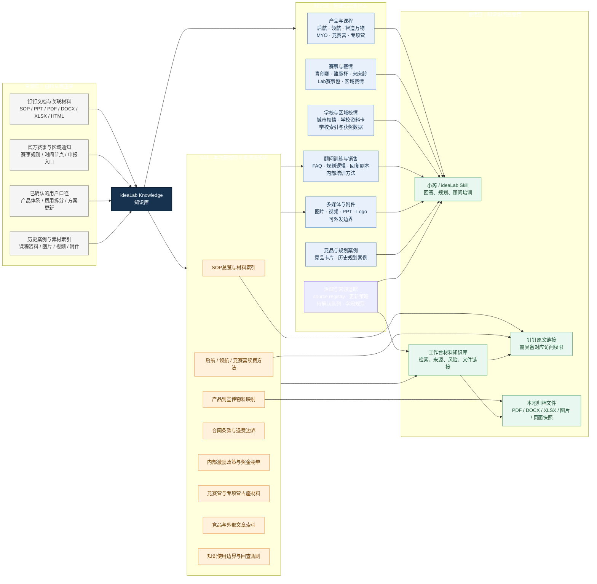

# ideaLab Knowledge 知识地图

> 版本：2026-09-30。图中 `S21` 是本次新增的钉钉销售 SOP 清洗批次；它已经接入工作台只读索引，但高风险事实仍需回查当期原文。

## 读图要点

| 层 | 作用 | 当前代表内容 |
|---|---|---|
| 来源层 | 保留材料出处和证据形态 | 钉钉 SOP、赛事通知、用户确认口径、课程与素材原件 |
| 知识域 | 把原材料整理成可检索的主题 | 产品课程、赛事赛情、校情、顾问训练、素材、竞品与案例 |
| S21 批次 | 补齐近期销售 SOP 的方法和材料入口 | 产品物料、续费逻辑、合同/奖金/占座/竞品边界 |
| 使用层 | 让人或系统调用知识 | 小芮回答、工作台检索、钉钉原文链接、本地文件链接 |

## 风险颜色和使用边界

- 蓝色：稳定的知识域入口，可以作为检索和回答的主题。
- 橙色：S21 新增内容。它包含“8 月在售”等历史时间口径，不能直接当成当前价格或政策。
- 灰色：原始来源，回答时应保留来源和核验时间。
- 绿色：使用出口。文件链接可以提供，但钉钉链接受权限控制，本地文件不应直接发给外部家长。
- 合同、退费、奖金、占座、当月在售和竞品判断，都必须回查当期 SOP、正式合同或官方来源。
