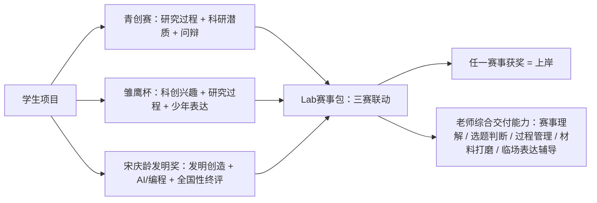

# 三赛关系图

## 解释

三项赛事不是同一个分母，也不是同一个能力模型。内容生产时不要把它们当成可以直接相加的概率，而要讲成一个项目成长矩阵：

- 青创赛代表研究规范、真实问辩和创新素养。
- 雏鹰杯代表少先队科创参与、项目表达和层层筛选。
- 宋庆龄发明奖代表全国性发明创造、AI 编程和终评答辩。

Lab 赛事包的价值是把同一个学生项目放进多场景评审里管理，而不是临近比赛才做材料包装。
