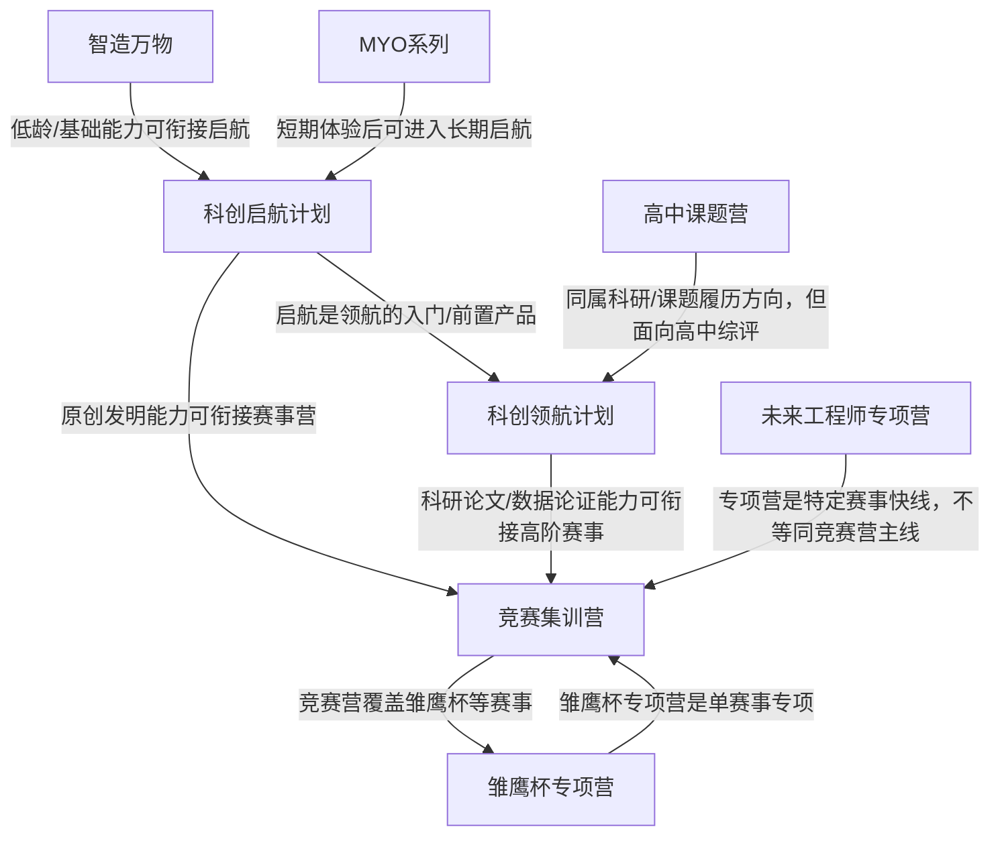

# 产品关系图

## 关系解释

- 智造万物 -> 科创启航计划：低龄/基础能力可衔接启航（关系类型：`foundation_to`）
- MYO系列 -> 科创启航计划：短期体验后可进入长期启航（关系类型：`trial_to`）
- 科创启航计划 -> 科创领航计划：启航是领航的入门/前置产品（关系类型：`upgrade_to`）
- 科创启航计划 -> 竞赛集训营：原创发明能力可衔接赛事营（关系类型：`can_feed_into`）
- 科创领航计划 -> 竞赛集训营：科研论文/数据论证能力可衔接高阶赛事（关系类型：`can_feed_into`）
- 竞赛集训营 -> 雏鹰杯专项营：竞赛营覆盖雏鹰杯等赛事（关系类型：`covers_competition`）
- 未来工程师专项营 -> 竞赛集训营：专项营是特定赛事快线，不等同竞赛营主线（关系类型：`parallel_special_track`）
- 雏鹰杯专项营 -> 竞赛集训营：雏鹰杯专项营是单赛事专项（关系类型：`specialized_subset`）
- 高中课题营 -> 科创领航计划：同属科研/课题履历方向，但面向高中综评（关系类型：`adjacent_research_track`）
