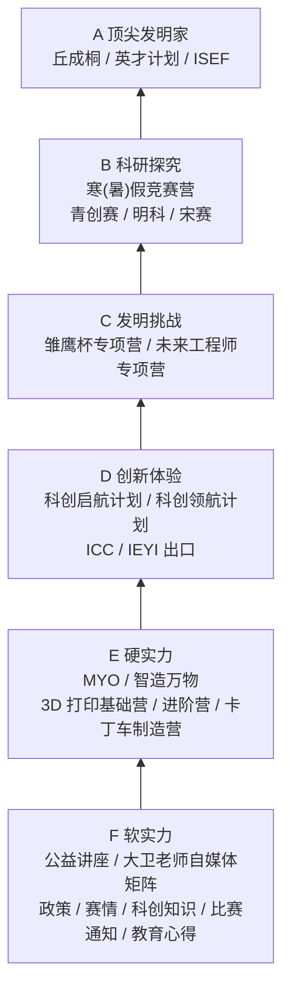
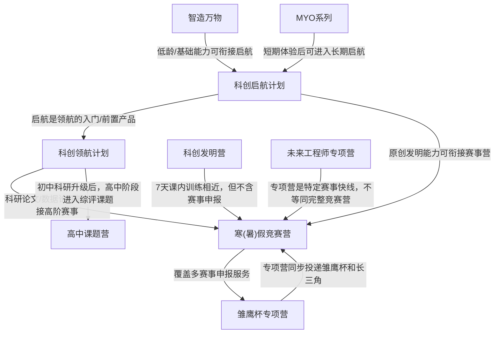

# 产品关系图

## 产品体系金字塔

说明：旧版金字塔形状和内部能力阶梯文案可保留；课程产品和出口赛事放在两侧。硬实力层的 Deepseek AI 机器人营已移除，更新为 MYO 和智造万物。

## 产品衔接关系

## 关系解释

- 智造万物 -> 科创启航计划：低龄/基础能力可衔接启航（关系类型：`foundation_to`）
- MYO系列 -> 科创启航计划：短期体验后可进入长期启航（关系类型：`trial_to`）
- 科创启航计划 -> 科创领航计划：启航是领航的入门/前置产品（关系类型：`upgrade_to`）
- 科创启航计划 -> 寒(暑)假竞赛营：原创发明能力可衔接赛事营（关系类型：`can_feed_into`）
- 科创领航计划 -> 寒(暑)假竞赛营：科研论文/数据论证能力可衔接高阶赛事（关系类型：`can_feed_into`）
- 科创发明营 -> 寒(暑)假竞赛营：7天课内训练相近，但科创发明营不含后续赛事申报、论文和正式比赛材料（关系类型：`non_application_variant_of`）
- 寒(暑)假竞赛营 -> 雏鹰杯专项营：寒(暑)假竞赛营覆盖多赛事申报服务（关系类型：`covers_competition`）
- 未来工程师专项营 -> 寒(暑)假竞赛营：专项营是特定赛事快线，不等同完整竞赛营（关系类型：`parallel_special_track`）
- 雏鹰杯专项营 -> 寒(暑)假竞赛营：雏鹰杯专项营同步投递雏鹰杯和长三角（关系类型：`specialized_track`）
- 科创领航计划 -> 高中课题营：初中科研升级后，高中阶段进入综评课题（关系类型：`stage_upgrade_to`）
